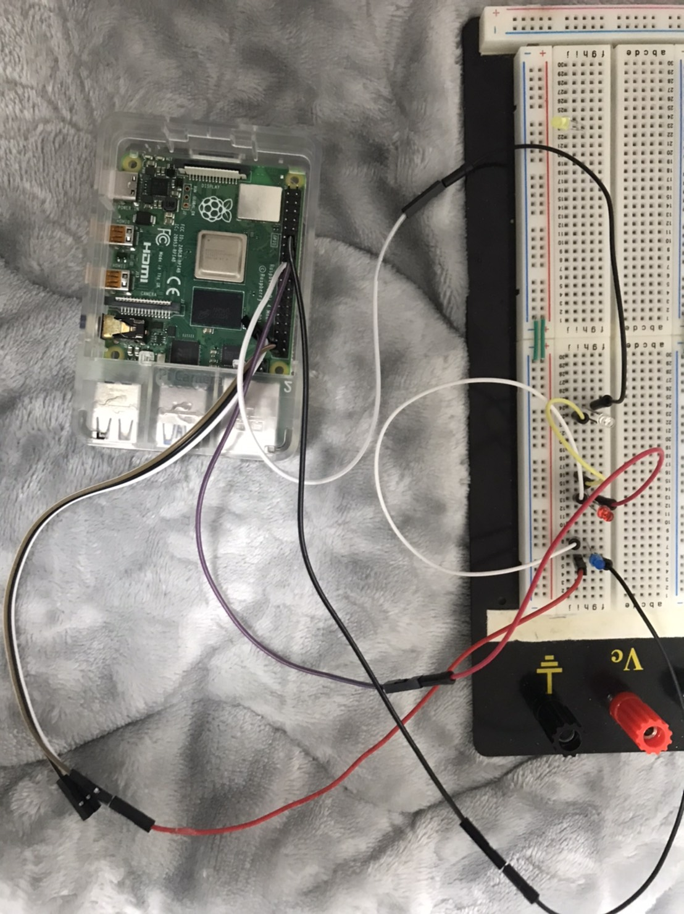

## robosys2020_LED_Driver

# robosys2020 課題

### 動作環境
今回の課題で使用した環境は以下の表に示す。
|||
|:--:|:--:|
|Raspberry Pi|Raspberry Pi Model 4|
|OS| Ubuntu20.04|

## 今回の課題で使用した回路


## 課題１の内容
LEDを３つ使用して、LED単体で光らせたり、複数で光らせる。

## インストール手順
### デバイスドライバのインストール
```bash:
$git clone https://github.com/pohsho/robosys2020_LED_Driver.git
$cd robosys2020_LED_Driver
```
### デバイスドライバのビルド
コマンドで行う場合
```bash:
$make
$sudo insmod myled.ko
$sudo chmod 666 /dev/myled0
```
### デバイスドライバのアンインストール
```bash:
$sudo rmmod myled
```
※一度以上makeしている場合にのみこのコマンドを使用する

# 動作方法
動作＜LED＞
```bash:
$echo 0 > /dev/myled0  ＃すべてのLEDが消灯
$echo 1 > /dev/myled0　＃左のLEDが点灯
$echo 2 > /dev/myled0　＃真ん中のLEDが点灯
$echo 3 > /dev/myled0　＃右のLEDが点灯
$echo 4 > /dev/myled0　＃左と真ん中のLEDが点灯
$echo 5 > /dev/myled0　＃左と右のLEDが点灯
$echo 6 > /dev/myled0　＃真ん中と右のLEDが点灯
$echo 7 > /dev/myled0　＃すべてのLEDが点灯
```

## アピールポイント
Pin番号によってLEDの数を変えたり、光らせる場所を変えることが出来るため、使用者が目的に合わせて使い分けをすることが出来る点である。例えば、信号機などとして利用出来たりする。
## コントリビューション
今回自分がやったこととしては、初期のプログラムでは一つのLEDが点灯したり消灯するだけであったが、LEDを３つそれぞれを光らせたかったので、LEDが３つそれぞれに光らせるようにしたことである。
## デモ動画
https://youtu.be/tx2mEkSt5lA
## 参考資料
https://github.com/ryuichiueda/robosys_device_drivers.git
## 共同制作者
個人情報保護のため、ソースコード内のAUTHORを参照
